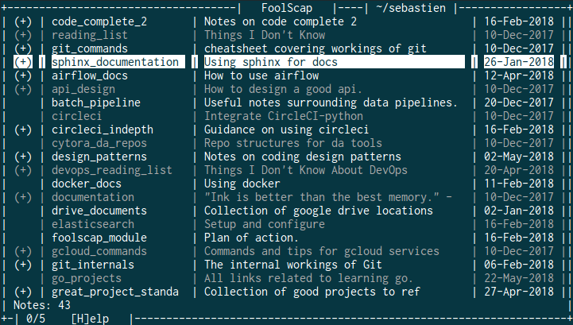
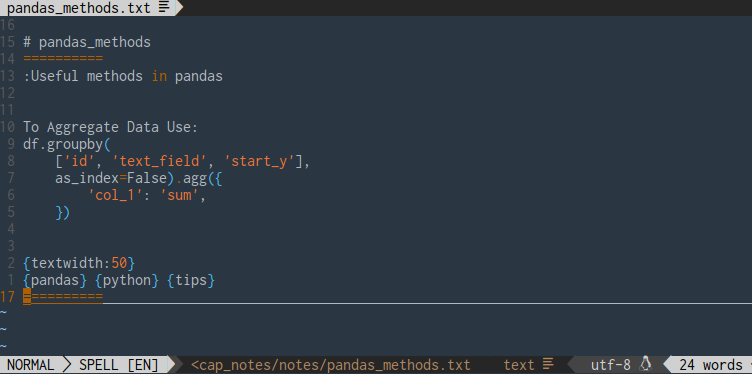

# Foolscap Note Manager


The foolscap note manager centralises note **storage**, allows **access** from any directory and
aims to make notes easy to **maintain**, **find** and **reuse**.

Foolscap uses the `vim` text editor.

## Install:

To install foolscap do the following:

    pip install git+ssh://git@github.com/GiantsLoveDeathMetal/foolscap.git@master

Create the following directories:

    mkdir ~/.fscap_notes
    mkdir ~/.fscap_notes/data
    mkdir ~/.fscap_notes/notes
    mkdir ~/.fscap_notes/deleted

Add the following to your `.bashrc`

    export FSCAP_DIR=~/.fscap_notes

---

## Using the TUI

The following commands are available in the user interface

- **Help:** `[H]`
- **Edit:** `[i]` (like vim Insert)
- **View:** `[Enter]`
- **Export:** `[X]`
- **Expand:** `[e]`
- **Collapse:** `[e]`
- **Jump to top:** `[g]`
- **Jump to bottom:** `[G]`
- **Quit:** `[q]`

Most command line features have been implemented in the tui.



---

## Using Foolscap from the command line

Below is a breakdown of the features:

### Create a new note

This will open the default note template:

    fscap new

### Saving notes from .txt

To save a note that has been written in a `.txt` one can use the following command:

    fscap save my_note.txt

Multiple notes in one `.txt` will be separated into different notes.

### List notes

This allows the user to view their all the notes.

    fscap list

Filter notes by a specific tag

    fscap list <tag>

List notes by tags

    fscap list -t=tags

To view a different list, use the `book` flag

    fscap list -b=<book_name>

### View a note

This displays the note in `stdout`

    fscap view <note_title>

Display only a snippet of the note from <first_line> to <last_line>

    fscap view <note_title>@<first_line>:<last_line>

### Search for notes

To search for a note by it's title

    fscap search <title_sub_string>

This will search in all `books`

### Edit a note

The `edit` command allows you to open a note in the `vim`

    fscap edit <note_title>

Any tags will be updated.

### Exporting a note

Exporting will save a copy of the note in your current directory

    fscap export <note_title>

### Delete a note

To delete a note, type command:

    fscap delete <note_title>

### Move lines across notes:

Foolscap allows you to move lines from one note to another using the `move-to` command:

    fscap move_lines <note_title>

Then you will be prompted for the note you want to take the lines from, enter the title of the note you'd like to take lines from. This should open a vim editor, specify the lines you'd like to move with `>` at the beginning of each line.

### Migrate data

If you have an outdated version of foolscap you can update the meta data like so

    fscap migrate

---

## Note Structure:

A typical note will contain the following:

    # title_my_note
    ===============
    :Description of my note

    I can begin typing out notes
        - one topics
        - as a check list
        - etc

    {macro:tags}
    {checklist} {code} {tags}
    ================



### title_of_note:

Titles begin with `#` and have a limit to the number of characters. They can not contain space, `@` or `:`.
All notes must have a title.

### note content:

Note content are captured by `'=='` on the first line after your title and the last line of the note.

### :The note description

This falls directly below the first `'=='` line of the note.
This is optional, but allows an easier reminder of the contents of the note.

### {tags}

The tags should be place on the last line of the note before the note's line ending.
These tags allow for filtering by tag when searching for notes.

### {macro:tags}

Macro tags are my **favourite** features of foolscap.

The following macro tags have been implemented

- book; stores notes in a different list, by default all notes are assigned to `general`
see [list notes](readme.md#list-notes) to access these other notes.

```
{book:meetings}
```

- textwidth; this sets the text width in vim when opening the note

```
{textwidth:40}
```
